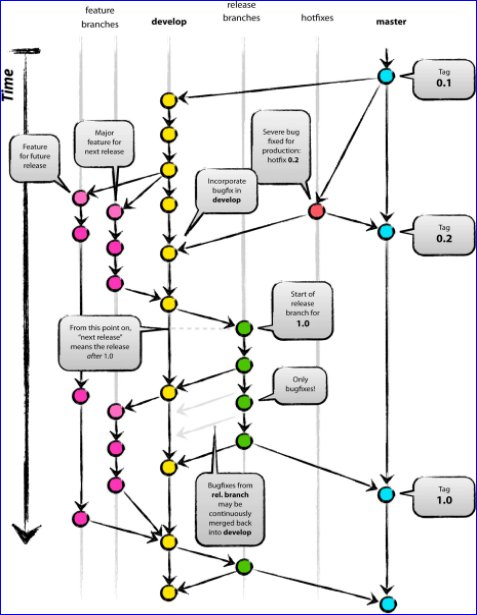
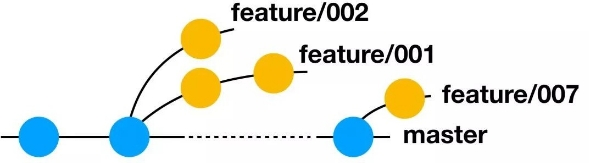
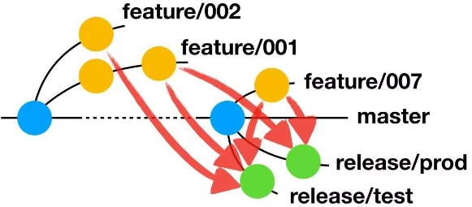
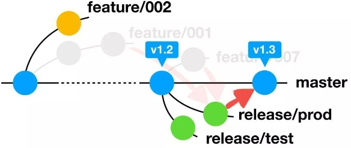

# git_branch
# git版本管理及常用指令 :see_no_evil:

目录

[1.1 分支规范	1](#_toc19203)

[方案一：Git Flow 模式	1](#_toc17056)

[常用分支规则	3](#_toc2366)

[Master分支	3](#_toc25334)

[Develop分支	3](#_toc27463)

[Feature分支	3](#_toc30548)

[Release分支	3](#_toc29661)

[Hotfix分支	4](#_toc11557)

[日常工作模式	4](#_toc471)

[紧急需求和Hotfix	4](#_toc6800)

[方案二：AoneFlow模式	5](#_toc683)

[基本使用规则	5](#_toc3959)

[规则一，开始工作前，从主干创建特性分支。	5](#_toc17900)

[规则二，通过合并特性分支，形成发布分支。	5](#_toc18293)

[日常工作模式	6](#_toc25042)

[紧急需求和Hotfix	7](#_toc19646)

[部分功能取消上线	7](#_toc22812)

[多环境支持	7](#_toc6928)

[分支使用规则	7](#_toc29883)

[主干分支规则	7](#_toc19220)

[功能分支规则	7](#_toc6190)

[发布分支规则	8](#_toc4575)

[标签规范	8](#_toc19838)

[【常用命令】](#ufyh-1701975693298)

[正常提交流程](#fptl-1701970971050)

[1. git remote 远程 分支、地址](#3660-1559181059710)

[2. git branch 分支查看、建立](#2883-1559181735739)

[3.git checkout 切换、撤销工作区修改](#8426-1559181763282)

[4. git commit 文件提交，message修改](#8765-1559182298233)

[5.git reset (撤销commit和暂存及版本回退)](#5786-1559286009092)

[6. git  revert回退push](#uqtw-1619415359896)

[7. git bisect 二分查找导致错误的提交](#3484-1585489201080)

[8.  git clean删除 untracked files](#23yw-1615867031530)

[9. git diff 对比差异](#4tjg-1701970892218)

[10. git merge 合并代码](#3671-1584808015839)

[11. git cherry-pick 选取commit](#30yy-1617095951943)

[12. git stash远程本地代码冲突解决](#1743-1548819011039)

[13. git blame 查看代码提交](#6419-1557734253013)

[14. git log --all 查看月提交代码量](#4042-1574234310336)

[15. git push推送远程](#4042-1547453474640)

[16.git rebase 删除某个提交](#qcee-1627886957918)

[17. fork 同步源仓库](#9wmy-1701962975482)

[18 .git在线更新版本](#nrbq-1701962975490)

#
1. # **分支规范**
## **方案一：Git Flow 模式**
经典的Git工作模式，源于Vincent Driessen提出了 [A Successful Git Branching Model](http://nvie.com/posts/a-successful-git-branching-model/)论文。下面是Git Flow官方的流程图

### **常用分支规则**
#### **Master分支**

注：其中[]中为可选项，视项目情况而定，下同。
#### **Develop分支**

#### **Feature分支**

#### **Release分支**

#### **Hotfix分支**

### **日常工作模式**

1. 项目开始情况下代码管理员会初始化远程仓库，并基于master的初始版本创建三条分支，他们是**origin/master(对应生产)，origin/release(对应测试环境)，origin/develop(对应开发环境) 并为这三条分支设置保护策略，三条分支均不允许直接的commit与push修改。**
1. 项目规划本次上线的需求和版本。
1. 开发接到需求后基于develop分支切功能分支进行开发。
1. 功能开发完成后依次合并代码到develop分支进行联调，并提交PR进行code     review。
1. 联调完成后准备测试时由develop分支合并到release分支，并发布到测试环境进行测试。
1. 测试完成后基于release分支进行发布，发布成功后将release分支合并到master分支和develop分 支，并在master分支上打tag标记。

### **紧急需求和Hotfix**
1\. 在上述过程中，需要hotfix或者有紧急需求时，则需要从master切hotfix分支进行修复，修复后直接拿hotfix分支上线，上线完成后合回master、develop、release分支。

## **方案二：AoneFlow模式**
其他主流发布模式和分支使用方式。AoneFlow 只使用三种分支类型：主干分支、特性分支、发布分支，以及三条基本规则。
### **基本使用规则**
#### **规则一，开始工作前，从主干创建特性分支。**
AoneFlow 的特性分支基本借鉴 GitFlow，没有什么特别之处。每当开始一件新的工作项（比如新的功能或是待解决的问题）的时候，从代表最新已发布版本的主干上创建一个通常以

feature/ 前缀命名的特性分支，然后在这个分支上提交代码修改。也就是说，每个工

作项（可以是一个人完成，或是多个人协作完成）对应一个特性分支，所有的修改都不允许直接提交到 主干。

#### **规则二，通过合并特性分支，形成发布分支。**
AoneFlow 的发布分支设计十分巧妙，可谓整个体系的精髓。GitFlow 先将已经完成的特性分支合并回公共主线（即开发分支），然后从公共主线拉出发布分支。TrunkBased   同样是等所有需要的特性都在主干分支上开发完成，然后从主干分支的特定位置拉出发布分支。而 AoneFlow 的思路是，从主干上拉出一条新分支，将所有本次要集成或发布的特性分支依次合并过去，从而得到发布分支。发布分支通常 以release/ 前缀命名。

###
#### **规则三，发布到线上正式环境后，合并相应的发布分支到主干，在主干添加标签，同时删除该发布分支 关联的特性分支。**
当一条发布分支上的流水线完成了一次线上正式环境的部署，就意味着相应的功能真正的发布了，此时 应该将这条发布分支合并到主干。为了避免在代码仓库里堆积大量历史上的特性分支，还应该清理掉已 经上线部分特性分支。与 GitFlow 相似，主干分支上的最新版本始终与线上版本一致，如果要回溯历史版本，只需在主干分支上找到相应的版本标签即可。

### **日常工作模式**
1. 项目选择一条分支作为主干分支（长期存在），例如master，主分支只保存和线上一致的代码， 不允许直接在上面提交代码。
1. 当有开发任务或者问题修复时由开发人员基于主分支切功能分支进行开发。
1. 需求开发完成后基于master切测试环境的发布分支release\_test，并将本次要测试的功能分支代码 依次合并过去。合并前最好同步master代码到本地防止冲突。合并时要进行Code Review。
1. 修改bug时基于功能分支进行修改，修改完成后提交到release\_test中。
1. 测试完成后，基于master切UAT环境的发布分支release\_uat，如果功能没有变动则直接将

   release\_test合并到release\_uat中。

1. 生产发布时基于master切生产环境的发布分支release\_prod，如果功能没有变动则直接将

   release\_uat合并到release\_prod中进行发布，发布完成后将release\_prod的代码合回master分支，并打上版本标签。

1. 发布成功后删除功能分支和release-test、release-uat和release-prod分支。

### **紧急需求和Hotfix**
1. 生产环境出现bug或者有紧急需求时需要从主分支切一个功能分支进行开发。
1. 修复完成后基于master切测试环境的发布分支release\_test，将修复的分支合并过去进行测试。如 果此时有其他需求在测试时需要搁置并让路。
1. 待生产Bug修复完成后按照正常标准进行发布。

### **部分功能取消上线**
1. 测试阶段或者UAT阶段，如果有一些功能的Bug较多无法满足上线要求或因为客户要求取消某些需 求时，则需要把这部分功能剔除出去。
1. 可以基于主分支重新切一条发布分支，并将要保留的代码合并到这个分支中，再进行一轮测试。测 试完成后再进行发布。
1. 是否需要再进行测试由需求影响范围决定。

### **多环境支持**
1. 假设有一些特殊的场景验证时可单独快速地组合一个发布分支，从而不影响其他环境的测试发布等。

### **分支使用规则**

#### **主干分支规则**

#### **功能分支规则**

#### **发布分支规则**

### **标签规范**

**【常用命令】**

git clone --sshAdress//克隆免密操作地址

**正常提交流程**

git pull  更新代码到最新     等价于 fetch+merge  ---与本地冲突(备注：切分支一定要stash or 解决冲突)

git stash 本地保存到stash栈（同时本地回退到上一次pull的版本，commit到仓库的则还在本地仓库里面）

git stash pop /git stash pop stash@{0}  将stash栈出栈并自动合并（除去冲突）

`                 `git stash clear  :注意这是清空你所有的内容

`                 `git stash drop stash@{0}  这是删除第一个队列

`      `git  diff filename   查看未暂存的文件更新了哪些

git status 查看需要提交的文件  //双击文件可以做选项

`              `git checkout -- file-name    --删除未提交的修改（还原）

git add <files> 添加需要提交的代码   //  . ---当前所在目录下的文件。 \* ----递归文件及子目录文件 内核$git update-index --add <files>

git rm <files> 删除文件，直接变绿。将提交到远程，可通过版本回退找回，一般来说git只做加法，新增版本，不会实际删除文件。版本回退可以找回文件

`              `--git reset HEAD <file>/所有     //删除缓存区的修改(撤销add的修改) 

git commit    提交本地  注意bugid，Bugzilla Project

`             `--git commit --amend  //修改上一次提交的Message，已经push的需要用rebase修改

`             `--git pull 预防期间有人修改代码 (如果有更新，则会直接merge到远程)

git push 推送远程仓库

`              `-- git reset --hard 11dbc3ec07fe80e31110ebd65304c41390f9ddf5 //回退版本 

                //commit id 通过git log 建议gitk 或 git reflog（构建流）

**1. git remote 远程 分支、地址**

git remote   //列出所有远程主机（为了便于管理，Git要求每个远程主机都必须指  定一个主机名。）

git remote -v     //查看远程主机地址  fetch读  push写

追踪关联远程

1\. git checkout -b foo o/main 

2.git branch -u o/main foo

**2. git branch 分支查看、建立**

git branch -a     //查看远程分支

git branch  zTest  // Be careful新建zTest  分支 

**3.git checkout 切换、撤销工作区修改**

git checkout -b feature\_tribeMerge\_17A origin/feature\_tribeMerge\_17A 基于远程分支上新建一个名叫feature\_tribeMerge\_17A的分支

git checkout -b dev\_new    基于当前本地分支上新建一个名叫dev\_new的分支

git checkout -- file-name  //撤销未add(提交到暂存区)的修改.（谨慎）撤销工作区的代码（劳无所获！！！）

**4. git commit 文件提交，message修改**

$ git commit -m "hello world" //没有bugID 就用这个，不然会报bugID错误！！！

git commit --amend  修改上一次的提交信息（已push过的用rebase）

git rebase 重新指向另一个commit id。通常用于两分支合并前更新操作，操作比较规范（git pull会比较乱）

git rebase 对于历史提交信息的修改：

`        `$ git rebase -i HEAD~7     

`        `$ git rebase --abort   

`        `$ git rebase --continue（保持与远程代码同步为前提）

`          `git rebase - i HEAD~3  对3次提交信息编辑

`        `将需要修改的pick 改成 edit,自动切换到该提交

git rebase --continue  切换到第二个edit 该id //重复上面步骤

git push -f  将修改强制提交到远程 //加上-f，否则不会覆盖，需注意本地为远程最新代码，否则可能覆盖别人push的代码

git rebase 对远程基础进行重构，如删除某个提交drop，修改某次提交信息 edit

**5.git reset (撤销commit和暂存及版本回退)**

git reset HEAD <file> 来取消缓存区的修改，不添加<file>参数，撤销所暂存区staging的修改(即撤销git add 的文件)。

`                        `等价调用 git rm --cached goot.txt

git reset --hard commit\_id  回退到某个版本，需要使用git log 或git reflog查看历史。可以用于找回文件。

`       `会删除未提交的代码-包括工作区写的代码都没了，（git log 是远程的commit log ，git reflog 查看本地完整的git 操作） 

`       `提交远程有时要做reset hard丢弃某些提交记录，寻回可以到reflog查找本地记录但是只能找回commit到本地库的记录

git reset --soft(或--mixed) HEAD~2  仅撤销commit，add暂存区 的代码还在

`    `三个参数对比：

`        `--soft 只重置本地库/commit：绿

`        `--mixed 重置本地库/commit和暂存区  ：红

`        `--hard  重置本地库/commit、暂存区和工作区  ：clean

`    `HEAD指针：

`        `1.基于索引  git  reset --hard commit\_id 

`        `2.基于^  git reset --hard HEAD^ 只能后退，不能前进，^^^^^^ 一个符号表示回退一个版本，回退一百个版本哈哈

`        `3.基于~n      git reset --hard HEAD~3 只能后退

git push -f    强制提交 

`        `回退后，回退远程仓库提交（注意！！！！！如期间有新的push,会删除掉新的提交。理论上被删除的提交那个提交人本地仓库是有代码备份的）

git commit -m  报错 “hook declined  must descript“

重新提交，用文本文件的descrpt. 去掉参数-m

自由移动branch指向   git branch -f <branchName> <commitId>

**6. git  revert回退push**

1\.git reset hard <commitid> --清除这之后的提交记录  git push -f 强制提交覆盖 

2\.反做某个提交   revert会生成一个回退的更改记录

`    `git revert -n 8b89621019c9adc6fc4d242cd41daeb13aeb9861

`    `注意： 这里可能会出现冲突，那么需要手动修改冲突的文件。而且要git add 文件名。 （2）提交，使用“git commit -m 版本名”，如：

    git commit -m "revert add text.txt" 

**7. git bisect 二分查找导致错误的提交**

获得一个完全干净的空间

git stash push [-u | --include-untracked]  //包含未track的空间

**8.  git clean删除 untracked files**

git clean -f

**9. git diff 对比差异**

1\. git diff HEAD~2 获取最近两次提交的具体不同 包括增删的文件以及行数以及每行具体的改动 

2\. git diff --stat 获取文件更改的个数 增加行数 删除行数

3. git diff --numstat 表格形式获取增加行数和减少行数

**10. git merge 合并代码**

git merge --no-ff  分支名     mf\_dev 上合并功能分支  --no-ff 保存分支提交的commit节点,not fastForward模式

merge 和 rebase 区别

本质上 rebase 提交树比较干净,无分叉时等同merge -ff

merge 则不会更改提交的先后顺序，且生成一个合并的节点，有分叉时 merge -ff 等同于 merge --no-ff

**11. git cherry-pick 选取commit**

git cherry-pick <hashA> <hashB>

A需早于B提交  ，本地pick后记得 push到远程。

git cherry-pick 冲突 fix conflicts and run git cherry-pick --continue  

分支cherry-pick 提交 ，制造冲突，增加代码量(trp的代码统计方法)

**12. git stash远程本地代码冲突解决**

1\.不能stash时

git mergetool 自动合并 冲突（stash pop出来会加入暂存区） 

git stash  ----保存本地修改，恢复上次更新时的状态，

git pull

git stash pop   ---没有冲突时不会加进工作区，有冲突合并之后会auto-merge，加进暂存区

查看stash内容

git show stash@{n}

**13. git blame 查看代码提交**

git  blame -L 705,707 filename --哦豁，责备此行代码！！    注意选对范围：有些人会把代码插到别人代码块里面了

git  show fc9c5e52   ps:enter 看完所有文件 

**14. git log --all 查看月提交代码量**

git log --all --after="2019-9-1 00:00" --before="2019-9-30 23:59" 

--committer="TS.CAN.zxhe" --pretty=tformat: --numstat | gawk '{ add += $1 ; subs += $2 ; loc += $1 - $2 } 

END { printf "added lines:,%s removed lines :, %s total lines:, %s\n",add,subs,loc }'

**15. git push推送远程**

1\.//不能push

$ git push  

No refs in common and none specified; doing nothing.

Perhaps you should specify a branch such as 'master'.

Everything up-to-date

解决：$ git push origin master 指定track的远程仓库

**16.git rebase 删除某个提交**

git rebase -i  被删除的前一个commitid

`    `弹出文本框， 被删除的 pick 改为 drop   --成功删除指定的commit。代码又变为指向原来的提交人（与我无瓜）

git push origin HEAD --force

**17. fork 同步源仓库**

Best is not better. Developing is better than developed.

两种方式，

第一种在自己的fork仓库提交pull request，会产生merge commit，需要rebase。

第二种方式比较干净：

1\. 克隆自己的fork:

git clone git@github.com:YOUR-USERNAME/YOUR-FORKED-REPO.git

2\. 在自己的本地仓库新增远程源upstream（被fork的仓库），然后更新upstream:

cd into/cloned/fork-repo

git remote add upstream git://github.com/ORIGINAL-DEV-USERNAME/REPO-YOU-FORKED-FROM.git

git fetch upstream         注意：如果有冲突貌似fetch是不会拉取成功 fetch 和 pull 的区别

3\. 更新你的fork同步最新更改到你的仓库（origin/master):   注意：在tag版本下没更新成功

git pull upstream master

4\. 推送到自己的远程fork仓库:

git push origin

如果要强制：

git push origin --force

**18 .git在线更新版本**

git update-git-for-windows

